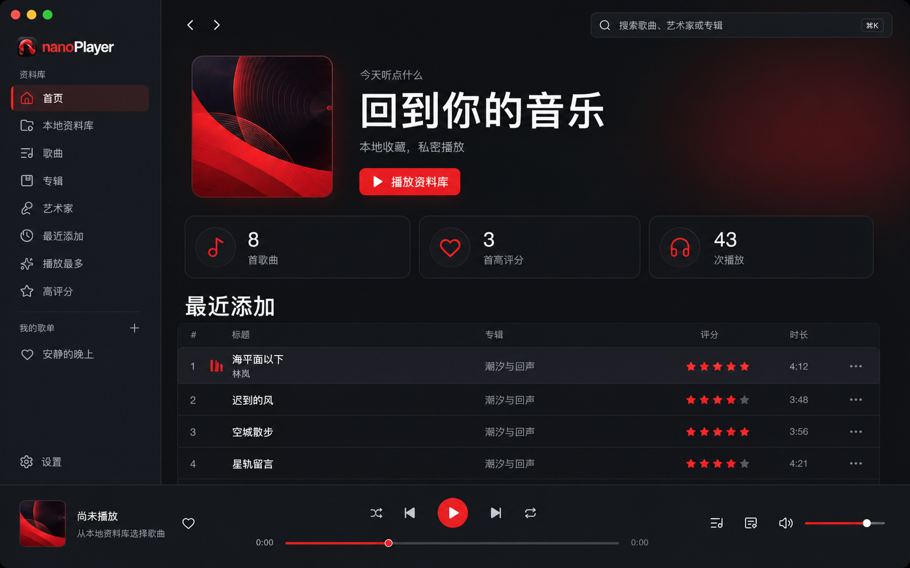

# nanoPlayer

[English](#english) · [中文](#中文)



## English

nanoPlayer is a local-first desktop music player for browsing and playing your own music library. Add approved folders, then explore tracks by song, album, artist, or genre—with playlists, ratings, a playback queue, lyrics, and output-device selection.

- Local playback with no account required
- Read-only source audio: nanoPlayer never edits or deletes your music files
- Local SQLite library for indexes, playlists, ratings, and listening history
- MP3, FLAC, M4A/AAC, ALAC, WAV, Ogg Vorbis, Opus, and AIFF support
- macOS available first; Windows and Linux builds are planned

## 中文

nanoPlayer 是一款本地优先的桌面音乐播放器。添加经过授权的音乐文件夹后，即可按歌曲、专辑、艺术家或流派浏览本地收藏，并使用歌单、评分、播放队列、歌词和输出设备切换等功能。

- 本地播放，无需账号
- 源音频只读：不修改或删除音乐文件
- 使用本机 SQLite 保存索引、歌单、评分与收听记录
- 支持 MP3、FLAC、M4A/AAC、ALAC、WAV、Ogg Vorbis、Opus 和 AIFF
- 首发支持 macOS，Windows 与 Linux 版本在规划中

## Project status / 项目状态

The first desktop feature set is implemented in this repository. See [First Version Status](docs/development/FIRST_VERSION_STATUS.md), [Design System](docs/design/DESIGN_SYSTEM.md), and [Product & Technical Plan](docs/PRODUCT_AND_TECHNICAL_PLAN.md) for verified behavior, the current visual baseline, and remaining release gates.

仓库已包含首个桌面版本的主要功能。已验证行为、当前视觉基线与剩余发布门槛分别见上述状态、设计系统和产品技术计划文档。

## Development / 开发

### Prerequisites

- Node.js 22+
- pnpm 11+
- Stable Rust with `rustfmt` and `clippy`
- Tauri 2 platform prerequisites for the target operating system

### Start developing

```bash
pnpm install
pnpm tauri dev
```

Run `pnpm check` for frontend lint, unit tests, type checking, and a production UI build. Run `pnpm test:e2e` for browser flows and `cargo test --manifest-path src-tauri/Cargo.toml` for the Rust core. Build a local macOS app with `pnpm tauri build --debug --bundles app`. The website is independent: `npm --prefix website run dev`.

## Safety boundary / 安全边界

Music directories are read-only inputs. Ratings, playlists, listening history, downloaded lyrics, artwork thumbnails, and recovery state belong in application-managed storage.

音乐目录仅作为只读输入。评分、歌单、收听记录、下载歌词、封面缩略图与恢复状态均保存在应用管理的数据目录中。
