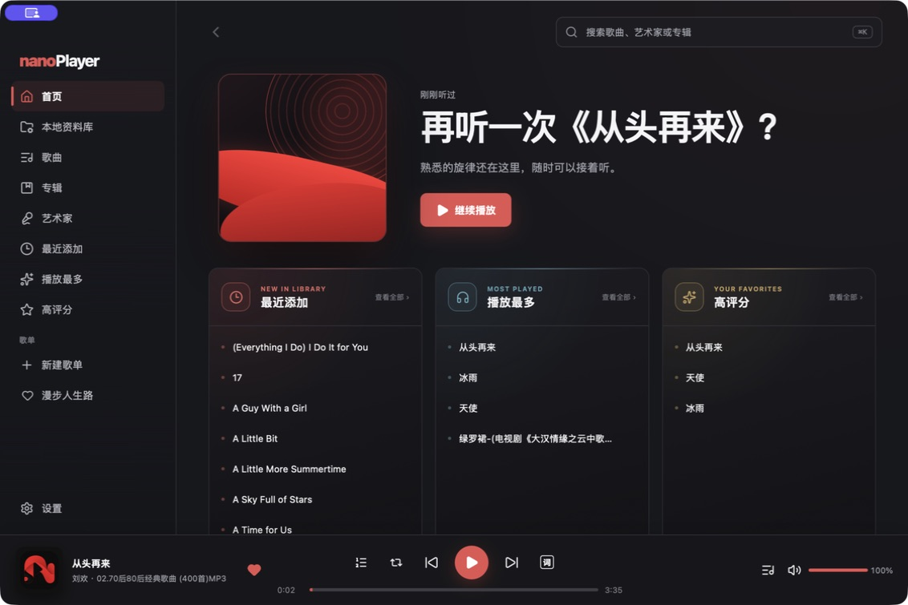

# nanoPlayer

[English](#english) · [中文](#中文)

[Website / 官网](https://nanoplayer-wei-feng.vercel.app) · [Downloads / 下载](https://nanoplayer-wei-feng.vercel.app/download)



Actual application screenshot captured on 2026-09-06. / 2026-09-06 拍摄的实际应用界面。

## English

nanoPlayer is a desktop music player focused on your local music collection. Add music folders, browse songs, albums and artists, and listen with playlists, ratings, a playback queue, lyrics and output-device selection. The home screen brings together recently added, most-played and highly rated songs.

- Local playback with no account required
- Read-only source audio: nanoPlayer never edits or deletes your music files
- Local SQLite library for indexes, playlists, ratings, and listening history
- MP3, FLAC, M4A/AAC, ALAC, WAV, Ogg Vorbis, Opus, and AIFF support
- Desktop downloads are available for macOS universal, Windows x64, and Linux x64
- Current packages are unsigned; macOS packages are not Apple-notarized

## 中文

nanoPlayer 是一款专注本地歌曲播放的桌面音乐播放器。添加音乐文件夹后，可以按歌曲、专辑和艺术家浏览收藏，使用歌单、评分、播放队列、歌词和输出设备切换。首页集中展示最近添加、播放最多和高评分歌曲。

- 本地播放，无需账号
- 源音频只读：不修改或删除音乐文件
- 使用本机 SQLite 保存索引、歌单、评分与收听记录
- 支持 MP3、FLAC、M4A/AAC、ALAC、WAV、Ogg Vorbis、Opus 和 AIFF
- 已提供 macOS 通用版、Windows x64 和 Linux x64 桌面安装包
- 当前安装包未签名，macOS 版尚未完成 Apple 公证

## Project status / 项目状态

The desktop client and an Android phone/Pad client are implemented in this repository; Android remains a local, qualification-incomplete build and is not publicly distributed. iOS/iPadOS is planned but not implemented. See the [client matrix](docs/clients/README.md), [desktop status](docs/clients/desktop/STATUS.md), [Android status](docs/clients/android/STATUS.md), [design system](docs/design/DESIGN_SYSTEM.md), and [product/technical plan](docs/product/PRODUCT_AND_TECHNICAL_PLAN.md).

仓库已包含桌面客户端和 Android 手机/Pad 客户端；Android 目前仅支持本地构建，验收尚未完成，也未公开发布。iOS/iPadOS 仍处于规划阶段。当前客户端边界、验证状态、视觉基线和产品计划见上述文档。

Repository and documentation boundaries are described in [Project Structure](docs/PROJECT_STRUCTURE.md). Dated audits and superseded plans are retained under [docs/archive](docs/archive/README.md) and are not current status sources.

## Development / 开发

### Prerequisites

- Node.js 22+
- pnpm 11+
- Stable Rust with `rustfmt` and `clippy`
- Tauri 2 platform prerequisites for the target operating system

### Start developing

```bash
pnpm install
pnpm tauri dev
```

Run `pnpm check` for frontend lint, unit tests, type checking, and a production UI build. Run `pnpm test:e2e` for browser flows and `cargo test --manifest-path src-tauri/Cargo.toml` for the Rust core. Build a local macOS app with `pnpm tauri build --debug --bundles app`. The website is independent: `npm --prefix website run dev`.

## Safety boundary / 安全边界

Music directories are read-only inputs. Ratings, playlists, listening history, downloaded lyrics, artwork thumbnails, and recovery state belong in application-managed storage.

音乐目录仅作为只读输入。评分、歌单、收听记录、下载歌词、封面缩略图与恢复状态均保存在应用管理的数据目录中。
