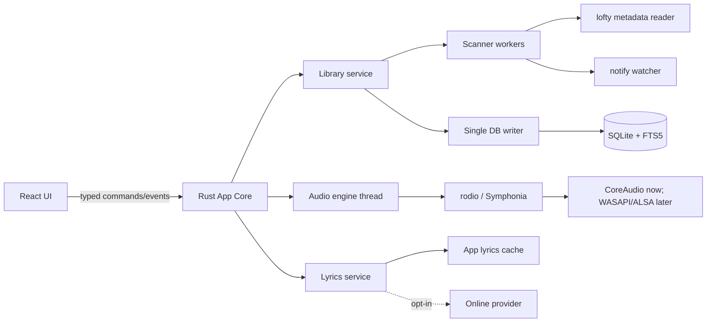

# nanoPlayer 产品、界面与技术方案

状态：第一版方案  
目标平台：macOS 优先，Windows / Linux 可迁移  
产品定位：本地优先、源文件只读、离线可完整使用的桌面音乐资料库与播放器

> 本文是产品与技术基线，不代表当前完成状态。实际实现和验证结果见 `development/FIRST_VERSION_STATUS.md`；已冻结的视觉规则见 `design/DESIGN_SYSTEM.md`。

## 1. 核心判断

nanoPlayer 第一版不应做成“带本地文件入口的在线音乐服务”，而应做成一个可靠的个人音乐资料库：用户授权一个或多个目录，应用只读取音乐和歌词；索引、评分、播放历史、歌单、网络歌词和封面缓存全部保存在应用自己的数据目录中。

第一版成功标准不是功能数量，而是以下闭环稳定：

1. 10,000 首规模的音乐库可以首次扫描、增量更新和快速搜索。
2. 常见格式能够稳定播放、暂停、跳转、切歌，并正确恢复队列与播放位置。
3. 专辑、艺术家、封面、歌词和多碟编号能够得到一致展示。
4. 删除资料库目录、歌单项目或应用记录时，绝不删除或改写源音乐文件。
5. 断网时除在线歌词匹配外，所有核心能力完整可用。

## 2. 产品原则

- **源文件只读**：扫描、播放、提取标签和封面只打开读取句柄。元数据修改作为可恢复的应用内覆盖保存；第一版不写回标签，不移动或删除源文件。
- **本地数据归本地**：资料库数据库、用户评分、歌单、统计和缓存默认只保存在本机，不要求账号。
- **网络能力可解释**：只有用户启用在线歌词后才联网；请求字段、来源、匹配置信度和缓存位置可见。
- **不中断播放**：扫描、封面解析、搜索建索引、歌词匹配均不得占用音频线程。
- **可恢复**：数据库采用迁移版本和定期备份；异常退出后队列、播放位置和统计不重复、不丢失。
- **跨平台核心统一**：播放器、扫描器、数据库和业务规则用 Rust 实现；macOS 首发只增加系统媒体控制、菜单和签名适配，不把核心写死在 macOS API 中。

## 3. 第一版功能范围

### 3.1 资料库与目录

- 左侧导航设置独立一级菜单“本地资料库”，与“歌曲”“专辑”“艺术家”等浏览入口平行；目录管理不藏在设置页中。
- 添加一个或多个本地目录，显示目录路径、可用状态、歌曲数和最近扫描时间。
- 手动重新扫描；应用启动后做轻量差异扫描；运行中监听新增、修改、改名和移出事件。
- 每个目录提供“重新扫描”和“移除目录”；界面避免使用含义不清的“删除文件夹”。移除目录只删除应用索引，不触碰磁盘文件。
- 支持文件类型（首版验收目标）：MP3、M4A/AAC、FLAC、WAV、Ogg Vorbis、Opus、AIFF、ALAC。
- 损坏、无权限或不支持的文件进入“扫描问题”列表，不阻断其余导入。
- 以文件系统标识和轻量内容指纹识别同一文件的改名/移动，尽量保留评分、次数和歌单引用。

暂不纳入：WMA、CUE 分轨、DSD、CD 抓轨、NAS 协议、云盘、自动写回标签、重复文件删除。

### 3.2 元数据与资料库模型

读取并规范化以下字段：标题、曲目艺术家、专辑艺术家、专辑、碟号/总碟数、曲号/总曲数、年份/日期、流派、作曲者、时长、比特率、采样率、声道、内嵌封面、MusicBrainz ID（存在时）。

展示回退规则：

1. 标题缺失时使用不含扩展名的文件名。
2. 艺术家缺失时显示“未知艺术家”，但数据库保留字段缺失状态。
3. 专辑缺失时显示“未知专辑”。
4. 专辑按“专辑名 + 专辑艺术家”聚合；合辑优先使用 Album Artist，避免按每位客席艺术家拆成多个专辑。
5. 多值艺术家保持关系表，不把展示字符串当唯一实体。
6. 原始标签值保留为可诊断快照，规范化值用于展示和搜索。

左侧一级浏览入口：本地资料库、歌曲、专辑、艺术家、最近添加、最近播放、播放最多、高评分。流派继续作为可搜索、可编辑的元数据，不设独立一级页面。扫描问题从“本地资料库”页面进入。

### 3.3 播放与队列

- 播放、暂停、上一首、下一首、拖动进度、音量、静音。
- 播放顺序与循环方式独立设置：顺序/随机播放可分别搭配不循环、全部循环、单曲循环；随机顺序在当前队列生命周期内稳定。
- “立即播放”“下一首播放”“添加到队列”，支持队列拖动排序和清空待播项。
- 记住当前队列、当前曲目、进度和播放模式；重启后恢复但不自动发声。
- 无缝播放作为目标能力，首版至少对同编码参数的相邻曲目完成专项验证。
- 音频输出设备切换、系统媒体键、macOS 控制中心/锁屏媒体信息。
- 文件临时不可用时跳过并给出非阻塞提示，不从资料库自动删除。

首版不做：均衡器、音效插件、变速、跨设备同步、AirPlay 控制、淡入淡出、ReplayGain 自动增益。ReplayGain 标签可以先入库，为后续预留。

### 3.4 歌单

- 新建、重命名、删除歌单；添加、移除、批量添加和拖动排序歌曲。
- 删除歌单或歌单项只影响应用数据库。
- 内置动态入口：最近播放、播放最多、高评分；第一版不开放自定义智能歌单规则。
- 导入/导出 M3U8 放在 1.1，不阻塞首发。

### 3.5 播放统计与评分

每次播放建立会话事件，记录开始时间、结束时间、实际聆听毫秒数、结束原因、是否达到计次阈值。拖动进度不算作实际聆听时间。

已实现计次规则（2026-09-06）：歌曲自然播放结束后才增加一次播放次数，一次会话最多计一次。暂停续播保留实际聆听时长；手动跳过、拖动进度或错误中断不计次。短曲同样支持；循环每完整播放一遍独立计次。轮询允许末尾最多 750 毫秒的检测误差，但必须有实际播放且收到自然结束信号。最近播放时间在实际开始播放时记录。播放最多仅展示次数大于零的歌曲，默认按次数降序，支持次数和最后播放时间排序，不显示添加日期。旧版真实歌曲历史次数保留，已知演示预置统计在迁移时扣除。

评分为 1–5 星，可清除为“未评分”。评分只写入应用数据库，不写回 POPM 等源文件标签。

### 3.6 歌词

自动选择优先级：用户手动指定 > 内嵌同步歌词 > 同目录同名 `.lrc` > 应用缓存的网络同步歌词 > 内嵌纯文本歌词 > 同名 `.txt` > 应用缓存的网络纯文本歌词。

- 支持常见 LRC 时间标签、offset、多行同时间戳和纯文本歌词。
- 在线匹配使用可替换的 `LyricsProvider` 接口；第一版可接 LRCLIB，但不能让单一服务协议渗透进 UI 和数据库模型。
- 自动匹配至少使用标题、艺术家、专辑、时长；高置信结果可自动缓存，歧义结果展示候选供用户选择。
- 网络歌词下载到应用管理的歌词缓存，不写入音乐目录。后续若提供“导出到音乐旁”，必须单独授权、明确确认并处理覆盖冲突。
- 页面显示歌词来源、同步/纯文本状态，并提供重新匹配与清除缓存。
- 允许用户手动选择 UTF-8 LRC/TXT；内容复制到应用数据库并优先于其他来源，可替换或移除，不修改原歌词文件。

## 4. 信息架构与界面

### 4.1 总体结构

采用“固定应用框架 + 内容区独立滚动”：

- 左侧栏（约 220 px）：首页、本地资料库、歌曲、专辑、艺术家等平行入口，以及歌单、添加歌单、设置。
- 中央内容区：当前页面标题、排序/筛选、网格或歌曲表格。
- 右侧抽屉（约 320 px，可关闭）：播放队列或歌词。
- 底部播放栏（约 88 px，始终固定）：当前歌曲、主控制、进度、音量、队列/歌词入口。
- macOS 使用融合标题栏与交通灯安全区；窗口窄于约 900 px 时右抽屉覆盖显示，左栏可收起；最小宽度建议 720 px。

### 4.2 视觉方向

不是直接复制 Spotify 或网易云音乐：借用 Spotify 的深色层级、封面主导和内容呼吸感，借用网易云音乐的高效歌曲表格、队列与歌词可达性，再加入 macOS 原生窗口、菜单、键盘焦点和材质克制度。

- 第一版默认使用已批准的深色红黑主题；设置中仍可显式选择跟随系统、浅色或深色。深色稿是发布视觉基线。
- 中性色为主，品牌强调色使用低饱和珊瑚红；只用于播放态、选择态和关键操作。
- 封面圆角 6–10 px，面板边界靠层级和细线，不堆叠重阴影。
- 高频操作用图标并提供 tooltip、无障碍名称和快捷键提示。
- 歌曲行 hover 才出现次要操作，播放态同时使用图标和文字/颜色，不能只依赖颜色。

### 4.3 关键页面

1. **首次使用**：解释只读承诺 → 选择音乐文件夹 → 展示扫描进度 → 进入资料库；允许跳过后从空状态添加。
2. **本地资料库**：独立一级页面；顶部提供“添加文件夹”，目录列表显示路径、可用状态、歌曲数、占用空间、最近扫描时间，以及“重新扫描”“移除目录”。底部明确提示移除不会删除磁盘文件，并提供扫描问题入口。
3. **歌曲**：紧凑表格，列为标题/艺术家、专辑、添加日期、评分、时长；支持多列排序和右键菜单。
4. **专辑**：封面网格；详情页包含大封面、专辑艺术家、年份、总时长、多碟分组和曲目表。
5. **艺术家**：艺术家列表/网格；详情顶部使用最多 4 张本地专辑封面拼图，下方以单一扁平歌曲表展示，不再按专辑分段。
6. **歌单**：可编辑标题、封面拼图、曲目拖排；空歌单提供明确添加路径。
7. **正在播放**：沉浸式封面 + 同步歌词；当前行高亮，允许点击歌词跳转。
8. **设置**：在线歌词开关与提供方、缓存占用、播放行为、外观、快捷键、数据库备份；目录增删留在“本地资料库”，避免入口重复。
9. **扫描问题**：按无权限/损坏/不支持/元数据异常分类，显示路径和可执行的重新扫描，不提供删除源文件按钮。

### 4.4 主要快捷键

- `Space`：播放/暂停（文本输入控件聚焦时不劫持）
- `⌘K`：全局搜索
- `⌘O`：添加资料库文件夹
- `⌘N`：新建歌单
- `⌘L`：打开/关闭歌词
- `⌘⇧Q`：打开/关闭队列
- `⌘,`：设置
- `←/→`：歌词/进度场景下按明确焦点规则工作，避免全局误跳转

## 5. 技术选型

### 5.1 推荐方案

| 层       | 选型                                     | 理由                                                                                           |
| -------- | ---------------------------------------- | ---------------------------------------------------------------------------------------------- |
| 桌面壳   | Tauri 2                                  | Rust 后端与系统 WebView，体积和内存通常优于捆绑 Chromium；同一核心可构建 macOS、Windows、Linux |
| 前端     | React + TypeScript + Vite                | 生态成熟，适合复杂资料库列表、队列和歌词状态；Vite 与 Tauri 配合直接                           |
| UI 状态  | Zustand                                  | 管理播放条、抽屉、选择和临时队列等高频客户端状态，保持依赖轻量                                 |
| 大列表   | TanStack Virtual                         | 10,000+ 曲目避免一次性渲染全部 DOM                                                             |
| 核心/IPC | Rust + Tokio + serde                     | 扫描、数据库、网络和播放的并发边界清晰；前端仅调用收窄后的命令                                 |
| 播放     | rodio + cpal，Symphonia 解码             | Rust 原生跨平台输出；常用格式、跳转与 gapless 配置可在同一核心控制                             |
| 标签     | lofty（严格只读使用）                    | 支持 MP3/MP4/FLAC/Ogg/Opus/WAV/AIFF 等多种标签和图片读取                                       |
| 数据库   | SQLite + rusqlite + migrations           | 单机事务可靠、备份方便；数据库只由 Rust 核心访问，避免前端持有任意 SQL 能力                    |
| 搜索     | SQLite FTS5 trigram/规范化辅助列         | 支持标题、艺术家、专辑、文件名的中英文子串检索；构建时固定并验证 FTS5 能力                     |
| 文件监听 | notify                                   | 跨平台文件事件入口；事件只触发防抖后的差异扫描，不能直接视为最终状态                           |
| 网络     | reqwest + provider adapter               | 仅用于歌词；统一超时、重试、User-Agent、限流和缓存策略                                         |
| 日志     | tracing                                  | 音频、扫描、数据库、歌词按模块记录，可导出脱敏诊断包                                           |
| 测试     | Rust 单元/集成测试 + Vitest + Playwright | 核心规则、组件状态和真实桌面关键路径分层验证                                                   |

### 5.2 为什么不首选 Electron 或 Flutter

- Electron 开发路径成熟，但随应用捆绑 Chromium，常驻播放器的安装体积和内存成本更高；如果团队只有前端工程能力、交付速度压倒资源占用，可重新评估。
- Flutter 桌面渲染一致，但音乐资料库依旧需要编写原生/FFI 音频与媒体控制层；现阶段不比 Rust 核心 + Web UI 明显降低风险。
- Tauri 的主要风险是三平台 WebView 差异和音频库边界，因此必须在第一个里程碑先做播放/跳转/无缝/设备切换技术验证，而不是先铺完整 UI。

### 5.3 进程与线程边界

约束：音频线程不访问网络、不跑扫描、不等待数据库写锁；扫描 worker 产生批次结果，由单一数据库写入队列事务化落库；UI 不直接读取任意文件路径或执行 SQL。

## 6. 数据模型草案

核心表及职责：

- `library_roots`：授权目录、平台权限凭据引用、可用状态、扫描策略。
- `media_files`：当前路径、文件标识、指纹、大小、mtime、格式、技术参数、可用状态。
- `tracks`：规范化曲目信息、专辑引用、碟/曲编号、时长、原始标签快照版本。
- `artists`、`track_artists`：多值曲目艺术家及顺序/角色。
- `albums`、`album_artists`：专辑聚合和专辑艺术家。
- `artwork`：来源、内容哈希、缓存尺寸，不把大图片直接重复塞入曲目行。
- `playlists`、`playlist_items`：用户歌单、稳定排序键、缺失文件仍保留引用。
- `track_user_state`：1–5 星评分、收藏预留、累计播放次数、累计聆听时长、最近播放。
- `playback_sessions`：逐次会话证据，用于统计恢复与规则演进。
- `lyrics`：来源、类型、内容、语言、匹配字段、置信度、缓存时间。
- `scan_runs`、`scan_issues`：扫描过程和可诊断错误。
- `app_state`：队列快照、当前曲目、进度、播放模式、schema 版本。

所有删除默认采用业务层事务；资料库文件移出时将媒体记录标记为 unavailable，再经完整扫描确认，避免瞬时文件事件误删用户状态。

## 7. 安全、隐私与数据治理

- Tauri capability 仅开放主窗口需要的命令；前端不获得整个 Home 目录通配读取权。
- 目录选择后，Rust 核心维护批准的规范化根路径，每次文件访问都重新校验路径属于根目录，防止符号链接和路径穿越越界。
- 网络歌词关闭时不发出任何歌曲元数据请求；打开时在设置中说明会发送标题、艺术家、专辑、时长。
- 封面、歌词和数据库位于平台应用数据目录；提供“清除缓存”与“导出/备份数据库”，明确区分缓存和用户数据。
- 日志默认不记录完整个人目录；诊断导出前对路径做 home-relative 或哈希脱敏。
- 首发采用开发者签名与 notarization；Mac App Store 沙盒版另行评估长期目录权限和 security-scoped bookmark，不作为第一版渠道前提。

## 8. 开发计划

以下按 2 名开发者（1 名前端/产品、1 名 Rust/桌面，可互相覆盖）估算；单人开发约需将日历周期放大到 1.5–2 倍。每阶段以验收门禁收口，不以“代码已写”作为完成。

### M0：方案与风险样机（1 周）

- 初始化 Tauri 2、React、Rust workspace、CI 和代码规范。
- 播放样本矩阵：8 种目标格式、跳转、暂停恢复、连续切歌、耳机拔插、输出设备变化。
- 用 lofty 只读解析真实标签/封面样本；验证损坏文件不 panic。
- SQLite 迁移、WAL、FTS5 trigram 和 10,000 条假数据查询基准。

门禁：播放关键格式且 UI 不阻塞；明确所有不支持格式和 gapless 实测结论。若 rodio 不能满足稳定性，立即在此阶段评估 GStreamer/libVLC 后端，不拖到后期。

### M1：资料库垂直切片（2 周）

- 目录授权、首次扫描、增量扫描、问题记录。
- 核心数据表、元数据规范化、封面缩略图缓存。
- 歌曲/专辑/艺术家三类页面与全局搜索；虚拟列表。

门禁：10,000 首冷启动扫描可观察、可取消、可恢复；移除目录不修改任何源文件；重启后资料库一致。

### M2：播放器与队列（2 周）

- 完整播放状态机、队列、两种播放顺序、三种循环方式、进度与常驻音量指示。
- 当前队列/位置恢复、文件不可用降级。
- macOS 媒体键、控制中心信息、原生菜单和快捷键。

门禁：8 小时连续播放、睡眠唤醒、音频设备切换、快速切歌和进度拖动无崩溃；恢复不自动播放。

### M3：歌单、评分与统计（1 周）

- 普通歌单 CRUD、拖动排序、批量添加。
- 1–5 星和未评分状态。
- 播放会话、计次规则、最近/最多/高评分动态入口。

门禁：跳转进度不能刷次数；异常退出后事件不会重复计数；歌单引用在文件临时离线时不丢失。

### M4：歌词与正在播放页（1–1.5 周）

- 内嵌歌词、LRC/TXT、同步滚动和点击跳转。
- 在线 provider、候选匹配、置信度、缓存和隐私开关。
- 正在播放沉浸页、队列/歌词右抽屉。

门禁：断网和 provider 失败不影响播放；错误自动匹配可撤回；下载不写入源目录。

### M5：完成度与 macOS 发布（1.5–2 周）

- 首次使用、设置、空状态、错误状态、键盘和 VoiceOver 基础可访问性。
- 数据库备份/恢复、缓存清理、崩溃恢复、脱敏日志。
- Intel/Apple Silicon 构建，签名、notarization、DMG、升级策略和发布说明。
- 真实音乐库回归、性能/内存/能耗检查。

门禁：干净 Mac 可安装并打开；所有核心路径有可重复验收记录；源目录前后内容哈希抽检一致。

### 后续 1.1 / 1.2

- 1.1：M3U8 导入导出、智能歌单、迷你播放器、ReplayGain、更多排序/筛选、手动歌词时间偏移。
- 1.2：Windows（WASAPI、SMTC、安装器）与 Linux（PipeWire/ALSA、MPRIS、deb/AppImage）适配；用同一格式与资料库测试集验收。
- 更后：可选标签编辑（必须显式切换出只读模式）、音乐指纹匹配、局域网/NAS、同步；这些都不进入首版承诺。

## 9. 测试与验收矩阵

- **格式**：每种格式覆盖短/长、封面有无、标签编码、多碟、VBR、损坏/截断样本。
- **文件系统**：多目录、重复路径、符号链接、目录离线、改名/移动、权限撤销、大量连续事件。
- **播放**：正常结束、手动跳过、seek、暂停退出、睡眠唤醒、设备拔插、单曲/列表循环、随机稳定性。
- **数据**：迁移、异常退出、WAL 恢复、数据库备份恢复、删除目录索引、歌曲离线后歌单/评分保留。
- **界面**：720/900/1440 px 宽度、浅/深色、键盘全路径、200% 缩放、长标题/CJK/RTL 基础布局。
- **只读证明**：测试音乐库导入前后递归内容哈希一致；应用运行时监控不出现源目录写操作。
- **性能目标（首版预算）**：常驻空闲 CPU 接近 0；10,000 首搜索主观即时（目标 P95 < 100 ms）；歌曲列表滚动保持流畅；扫描与播放并行无可听卡顿。具体内存和首扫时长在 M0 基准后冻结。

## 10. 需要尽早冻结的产品决策

1. 正式产品名和品牌色；`nanoPlayer` 可暂作工程名。
2. 首发渠道是官网 DMG 还是同时进入 Mac App Store。建议第一版先官网签名 DMG，降低长期目录权限和审核变量。
3. 在线歌词是否默认关闭。建议首次使用明确询问，默认关闭，用户开启后记住选择。
4. 是否把“收藏/喜欢”与“五星评分”同时存在。建议第一版只做评分，减少重复心智；高评分视图替代收藏入口。
5. 播放计次口径已于 2026-09-06 改为完整自然结束，回归测试覆盖暂停续播、跳过、拖动进度和循环。

## 11. 立即执行顺序

先做 M0 音频与文件权限样机，再冻结数据 schema 和播放状态机，随后实现资料库纵向切片。不要先投入完整视觉稿或网络歌词；这两部分建立在稳定播放、身份识别和只读扫描之上。
